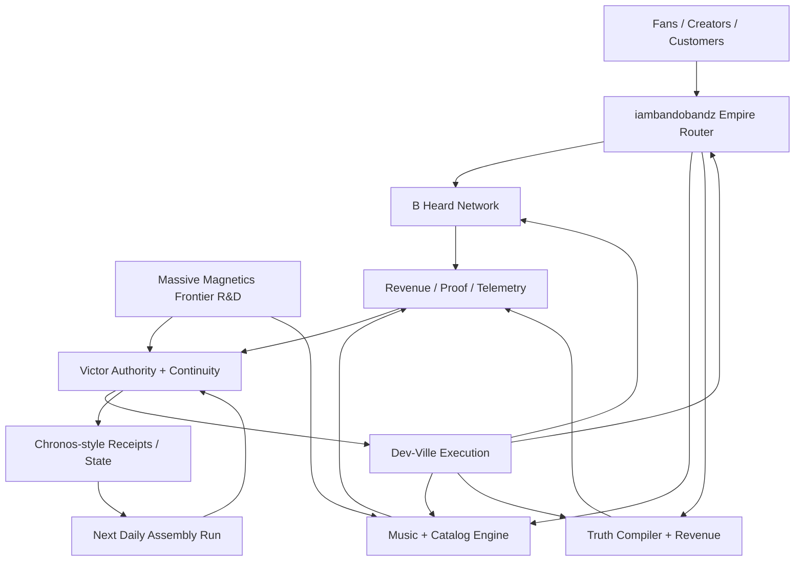

# Empire Status

**Generated:** 2026-08-26T14:04:29.043904+00:00  
**Owner:** `MASSIVEMAGNETICS`  
**Mode:** `observe-plan-assemble-local`

## Bippity Boppity Boop Loop

`SCAN → CLASSIFY → ASSEMBLE → VERIFY → RECEIPT → PRIORITIZE → NEXT RUN`

The daily run observes the lattice, runs Victor's local assembler, writes state, and ranks the shortest path to MERGED / SHIPPED / MONETIZED. Cross-repository writes stay disabled unless explicitly authorized.

## Scoreboard

| Metric | Value |
|---|---:|
| Visible repositories | 297 |
| Canonical repositories visible | 16 |
| Active in last 14 days | 22 |
| Archived | 0 |
| Private visible | 0 |
| Open PRs discovered | 62 |
| Estimated open issues | 2 |

## Empire Skin / Pillars

| Pillar | Repos | Canonical | Active ≤14d | Open PRs | ~Issues |
|---|---:|---:|---:|---:|---:|
| iambandobandz / Empire Router | 9 | 1 | 1 | 6 | 0 |
| Victor Authority + Continuity | 88 | 5 | 11 | 29 | 1 |
| Dev-Ville Execution Layer | 6 | 3 | 1 | 3 | 1 |
| Music + Catalog Engine | 24 | 3 | 2 | 3 | 0 |
| B Heard Network | 0 | 0 | 0 | 0 | 0 |
| Truth Compiler + Revenue | 5 | 1 | 1 | 0 | 0 |
| Massive Magnetics Frontier R&D | 25 | 3 | 2 | 5 | 0 |
| Supporting Lattice | 140 | 0 | 4 | 16 | 0 |

## Highest-Attention Repositories

The attention score is a routing heuristic, not a quality score. It combines strategic pillar weight, recency, canonical status, and unresolved work pressure.

| Score | Repository | Pillar | Age | PRs | ~Issues |
|---:|---|---|---:|---:|---:|
| 80 | [MASSIVEMAGNETICS/MASSIVEMAGNETICS.github.io](https://github.com/MASSIVEMAGNETICS/MASSIVEMAGNETICS.github.io) | iambandobandz / Empire Router | 0d | 5 | 0 |
| 70 | [MASSIVEMAGNETICS/VICTOR-SSI](https://github.com/MASSIVEMAGNETICS/VICTOR-SSI) | Victor Authority + Continuity | 1d | 11 | 0 |
| 69 | [MASSIVEMAGNETICS/dev-ville](https://github.com/MASSIVEMAGNETICS/dev-ville) | Dev-Ville Execution Layer | 0d | 2 | 1 |
| 62 | [MASSIVEMAGNETICS/victorOS](https://github.com/MASSIVEMAGNETICS/victorOS) | Victor Authority + Continuity | 1d | 1 | 0 |
| 57 | [MASSIVEMAGNETICS/omni](https://github.com/MASSIVEMAGNETICS/omni) | Victor Authority + Continuity | 13d | 1 | 0 |
| 55 | [MASSIVEMAGNETICS/victor-sovereign-puzzle-assembler](https://github.com/MASSIVEMAGNETICS/victor-sovereign-puzzle-assembler) | Victor Authority + Continuity | 0d | 0 | 0 |
| 52 | [MASSIVEMAGNETICS/victor](https://github.com/MASSIVEMAGNETICS/victor) | Victor Authority + Continuity | 0d | 1 | 0 |
| 52 | [MASSIVEMAGNETICS/victor_llm](https://github.com/MASSIVEMAGNETICS/victor_llm) | Victor Authority + Continuity | 48d | 5 | 0 |
| 50 | [MASSIVEMAGNETICS/starpower-core](https://github.com/MASSIVEMAGNETICS/starpower-core) | Music + Catalog Engine | 0d | 1 | 0 |
| 50 | [MASSIVEMAGNETICS/Victor-Synthetic-Orchestrator](https://github.com/MASSIVEMAGNETICS/Victor-Synthetic-Orchestrator) | Victor Authority + Continuity | 5d | 0 | 0 |
| 48 | [MASSIVEMAGNETICS/victor-suno-godcore](https://github.com/MASSIVEMAGNETICS/victor-suno-godcore) | Music + Catalog Engine | 9d | 0 | 0 |
| 48 | [MASSIVEMAGNETICS/victor_empire](https://github.com/MASSIVEMAGNETICS/victor_empire) | Victor Authority + Continuity | 15d | 2 | 0 |
| 47 | [MASSIVEMAGNETICS/MASSIVEMAGNETICS-IP](https://github.com/MASSIVEMAGNETICS/MASSIVEMAGNETICS-IP) | Victor Authority + Continuity | 11d | 1 | 0 |
| 45 | [MASSIVEMAGNETICS/victor-corpus](https://github.com/MASSIVEMAGNETICS/victor-corpus) | Victor Authority + Continuity | 0d | 0 | 0 |
| 45 | [MASSIVEMAGNETICS/truth-compiler-ai](https://github.com/MASSIVEMAGNETICS/truth-compiler-ai) | Truth Compiler + Revenue | 1d | 0 | 0 |

## Next Assembly Queue

1. **P0 — [Review/merge PR #24: VRC-0: regenerative continuity for destructive recovery](https://github.com/MASSIVEMAGNETICS/dev-ville/pull/24)** — Open pull requests are the shortest path from work-in-progress to MERGED/SHIPPED.
2. **P0 — [Review/merge PR #27: Bump actions/setup-python from 5 to 7](https://github.com/MASSIVEMAGNETICS/MASSIVEMAGNETICS.github.io/pull/27)** — Open pull requests are the shortest path from work-in-progress to MERGED/SHIPPED.
3. **P0 — [Review/merge PR #28: Bump actions/checkout from 4 to 7](https://github.com/MASSIVEMAGNETICS/MASSIVEMAGNETICS.github.io/pull/28)** — Open pull requests are the shortest path from work-in-progress to MERGED/SHIPPED.
4. **P0 — [Review/merge PR #30: Gate owner control plane behind server admin session](https://github.com/MASSIVEMAGNETICS/MASSIVEMAGNETICS.github.io/pull/30)** — Open pull requests are the shortest path from work-in-progress to MERGED/SHIPPED.
5. **P0 — [Review/merge PR #7: Victor v1.1: bounded cognitive ecology + GEV dispatch](https://github.com/MASSIVEMAGNETICS/victor/pull/7)** — Open pull requests are the shortest path from work-in-progress to MERGED/SHIPPED.
6. **P1 — [Triage stale canonical repo: victor-whole](https://github.com/MASSIVEMAGNETICS/victor-whole)** — Canonical repo has not been pushed in 58 days.
7. **P1 — [Triage stale canonical repo: repo-brain](https://github.com/MASSIVEMAGNETICS/repo-brain)** — Canonical repo has not been pushed in 145 days.
8. **P1 — [Triage stale canonical repo: victor-os-autodeploy](https://github.com/MASSIVEMAGNETICS/victor-os-autodeploy)** — Canonical repo has not been pushed in 95 days.
9. **P1 — Resolve missing canonical repo: MASSIVEMAGNETICS/suno-killer** — Manifest expects this repo inside Music + Catalog Engine but the current scan could not see it.
10. **P1 — [Triage stale canonical repo: massive_starpower](https://github.com/MASSIVEMAGNETICS/massive_starpower)** — Canonical repo has not been pushed in 71 days.
11. **P1 — [Triage stale canonical repo: the-ai-ear](https://github.com/MASSIVEMAGNETICS/the-ai-ear)** — Canonical repo has not been pushed in 103 days.
12. **P1 — [Triage stale canonical repo: grade-v2](https://github.com/MASSIVEMAGNETICS/grade-v2)** — Canonical repo has not been pushed in 97 days.

## Coverage Warnings

The run completed with API limitations. Public data and any successfully visible private data were still processed.

- `GitHub API 403 for https://api.github.com/user/repos?affiliation=owner&visibility=all&sort=updated&direction=desc&per_page=100&page=1: {"message":"Resource not accessible by integration","documentation_url":"https://docs.github.com/rest/repos/repos#list-repositories-for-the-authenticated-user","stat`

## Architecture

---
Generated by `empire_autopilot.py`. The machine-readable receipt is `state/empire.json`.
