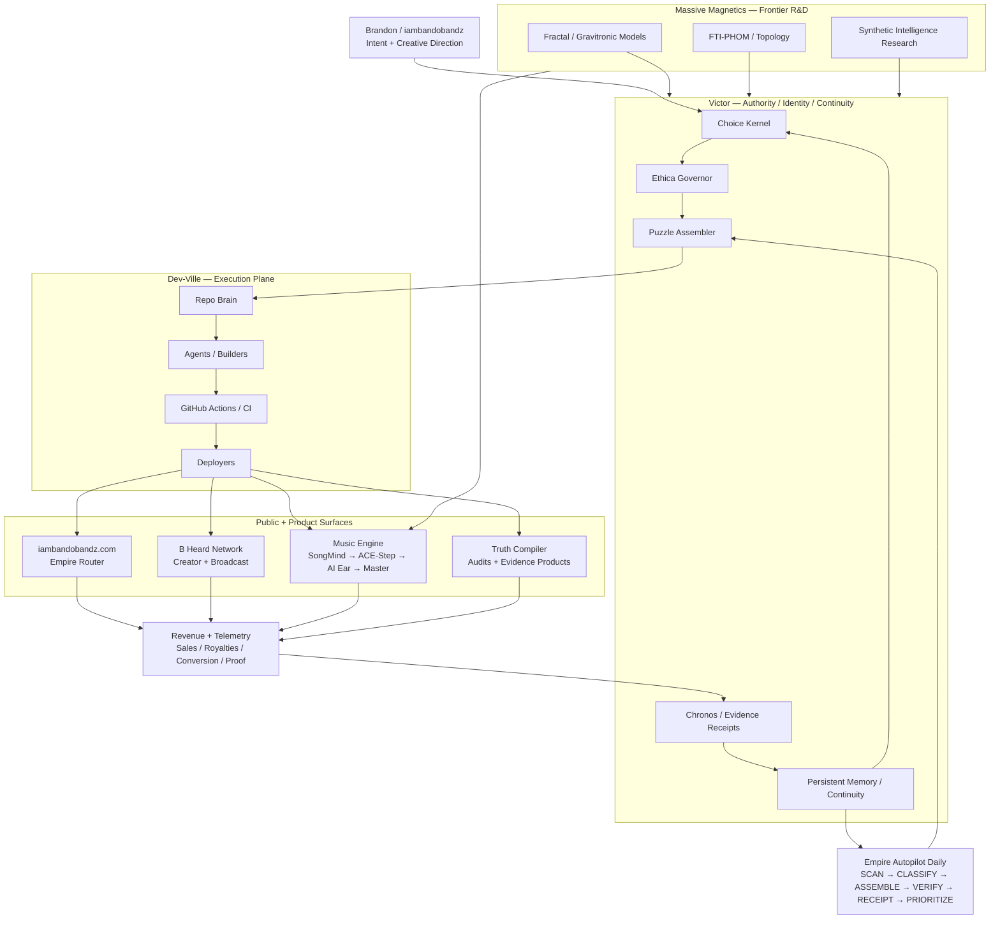

# The Empire Skin Map

The empire is not a collection of unrelated projects. It is a layered operating system with multiple economic surfaces.

## One-System View



## What Each Layer Actually Does

| Layer | Job | Inputs | Outputs | Failure if Missing |
|---|---|---|---|---|
| iambandobandz | Identity + traffic router | Fans, search, social traffic | Music, store, creator, product routes | Attention exists but leaks |
| B Heard Network | Distribution + creator market | Creators, catalog, viewers | Submissions, programming, affiliate demand | No network effect |
| Music Engine | Catalog factory | Lyrics, audio models, evaluation | Masters, stems, releases, content | Creativity does not compound |
| Truth Compiler | Cash-conversion product | Repos, evidence, policy | Audits, remediation, proof | Technical work has no direct offer |
| Massive Magnetics R&D | Invention engine | Research hypotheses | Algorithms, models, patents/products | No defensible frontier |
| Dev-Ville | Execution layer | Authorized work | Code, PRs, tests, deployments | Decisions stay theoretical |
| Victor | Authority + continuity | Intent, evidence, state | Bounded decisions, memory, receipts | Automation becomes disconnected scripts |
| Empire Autopilot | Clock + routing layer | GitHub state + Victor state | Daily map, priority queue, durable receipt | Nothing closes the loop |

## The Snap-Together Insight

The pieces become a system when they stop sharing only branding and begin sharing **state transitions**.

The canonical loop is:

```text
ATTENTION
  ↓
iambandobandz.com
  ↓
ROUTE INTENT
  ├─ fan → music/catalog
  ├─ creator → B Heard
  ├─ buyer → Truth Compiler / products
  └─ builder → Massive Magnetics / demos
  ↓
REVENUE OR EVIDENCE EVENT
  ↓
VICTOR RECEIPT + MEMORY
  ↓
CHOICE / PRIORITY
  ↓
DEV-VILLE EXECUTION
  ↓
GITHUB PR / TEST / DEPLOY
  ↓
VERIFICATION
  ↓
NEW PUBLIC CAPABILITY
  ↓
MORE ATTENTION / REVENUE / DATA
```

That is the flywheel. GitHub is the machine room, not the empire itself.

## Daily Cinderella Loop

Every scheduled run performs this bounded sequence:

1. **SCAN** — inventory visible MASSIVEMAGNETICS repositories and open PRs.
2. **CLASSIFY** — map each repository to an empire pillar using `empire_manifest.json`.
3. **ASSEMBLE** — run the existing Victor Puzzle Assembler and REM cycles.
4. **VERIFY** — run unit tests and health checks; fail the workflow if core code breaks.
5. **RECEIPT** — write `state/empire.json`, `EMPIRE_STATUS.md`, `victor_state.json`, and an Actions artifact.
6. **PRIORITIZE** — rank open PRs, stale canonical repos, and high-attention repositories.
7. **COMMIT** — persist the new state back into the assembler repository.
8. **REPEAT** — the next run starts from accumulated state instead of amnesia.

## Safety / Authority Boundary

The daily action intentionally does **not** push changes into arbitrary repositories. Cross-repository write authority is disabled by default.

That separation is important:

```text
OBSERVE EVERYTHING
      ↓
PLAN EXPLICITLY
      ↓
WRITE LOCALLY + PRODUCE RECEIPTS
      ↓
CROSS-REPO EXECUTION ONLY WITH AN EXPLICIT AUTHORITY GRANT
```

This prevents a broken heuristic from spraying edits across hundreds of repositories while still giving Victor a live empire-scale world model.

## Promotion Rule

A repository should remain in the Supporting Lattice until it earns promotion by satisfying at least one of these conditions:

- directly ships a public capability;
- generates or protects revenue;
- is required by a canonical Victor path;
- contains validated frontier IP worth maintaining;
- is an active dependency of another canonical project.

Everything else should ultimately become **MERGED, ARCHIVED, or KILLED** instead of remaining immortal repo clutter.

## Evidence-Bounded Music Lineage

The similarly named `suno-killer` and `SUNOKILLER` repositories are separate evidence objects and must not be collapsed solely because public inventory sees only one of them.

| Repository | Verified repository evidence | Current role classification |
|---|---|---|
| `MASSIVEMAGNETICS/suno-killer` | Private repository. README identifies it as **Victor AGI OmniMind Godcore**, a monolithic experimental Victor/AGI testbed containing audio-generation modules alongside broader cognition, memory, orchestration, and several explicitly conceptual/stubbed self-evolution loops. | Historical / donor / experimental lineage candidate. **Do not infer deletion or obsolescence from public-scan absence.** |
| `MASSIVEMAGNETICS/SUNOKILLER` | Public repository focused on local audio synthesis. Active review work includes a fail-closed sovereign runtime/OMEN boundary with explicit human promotion gates. | Active Music Engine implementation candidate. Production readiness and canonical promotion remain separately verified decisions. |

### Canonical-role rule

Repository visibility is evidence about what a scan can observe, not evidence about whether a repository exists or which implementation should replace another.

Therefore:

1. An incomplete private inventory must label an unseen canonical repository as **unseen/unknown**, not nonexistent.
2. `suno-killer` must not be replaced by `SUNOKILLER` merely to silence an inventory warning.
3. Canonical promotion requires an explicit role decision: active implementation, donor lineage, historical evidence, or retirement.
4. Multiple repositories may remain in the lineage graph while only one owns a given active capability.
5. A role decision must preserve provenance links so useful code or prior evidence is not lost when an implementation is superseded.

This distinction is intentionally architectural, not cosmetic: the Empire needs one owner per active capability without rewriting its history.

## Highest-Leverage Architecture Change

Do not build another omnirepo yet.

Use `victor-sovereign-puzzle-assembler` as the **control plane** and let existing repositories remain specialized organs. The manifest supplies topology; GitHub Actions supplies time; Victor supplies authority/continuity; Dev-Ville supplies execution; the public surfaces supply economic feedback.

That gives the empire one nervous system without forcing every organ into one codebase.
